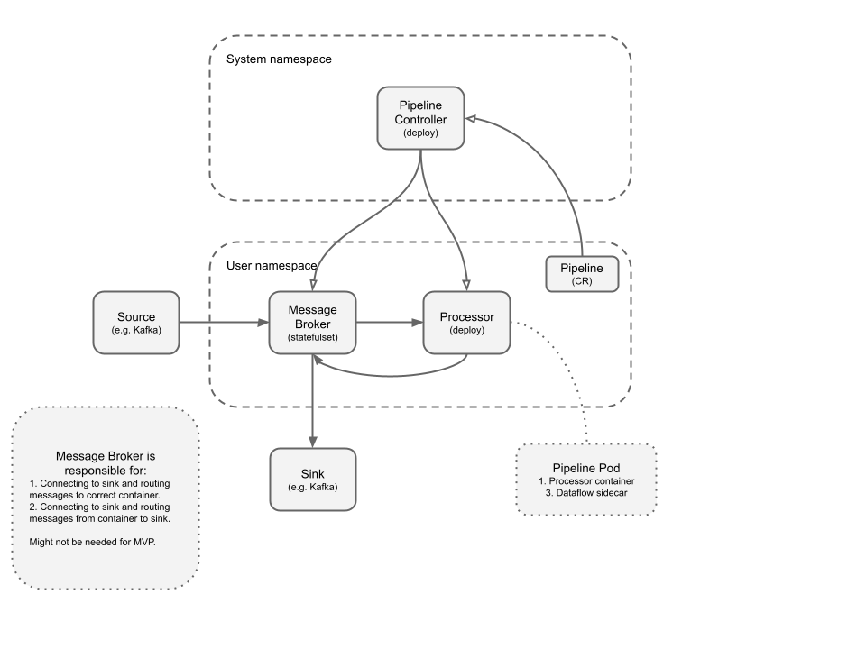

# Argo Dataflow

[](https://github.com/argoproj-labs/argo-dataflow/actions/workflows/go.yml)


## Summary

Argo Dataflow is intended as a cloud-native and language-agnostic platform for executing large parallel data-processing
pipelines composed of many tasks is typcially small and homogenic.

## Primer Reading

* [Streaming 101: The world beyond batch](https://www.oreilly.com/radar/the-world-beyond-batch-streaming-101) O'Reilly
  blog post
* [Streaming 102: The world beyond batch](https://www.oreilly.com/radar/the-world-beyond-batch-streaming-102) O'Reilly
  blog post
* [The Dataflow Model: A Practical Approach to Balancing Correctness, Latency, and Cost in Massive-Scale, Unbounded, Out-of-Order Data Processing](http://www.vldb.org/pvldb/vol8/p1792-Akidau.pdf)
  Google whitepaper(?)

## Use Cases

* Real-time "click" analytics
* Anomaly detection
* Fraud detection
* Operational (including IoT) analytics

## Related Software

* [Google Cloud Dataflow](https://cloud.google.com/dataflow)
* [Amazon Kenisis](https://aws.amazon.com/kinesis/) - including Data Streams, Data Firehose, and Data Analytics
* [Azure Stream Analytics](https://azure.microsoft.com/en-us/services/stream-analytics/)
* [StreamSet](https://github.com/streamsets) - [github](https://github.com/streamsets), Java based, Kubernetes, Managed
  platform
* [Spring Dataflow](https://dataflow.spring.io/docs/concepts/architecture), Java based, micro service orchestration (jar
  or docker image), Kubernets

## Collaborators and Consulted

To discus:

* Intuit
* RedHat
* Argo Community
* CNCF Serverless Workflows
* Google TektonCD team
* Kubeflow Pipelines team

## Proving the Solution

1. The "Hello World" of data processing. Word count.
1. Release Velocity Project collects all the releases events from Kafka and does Filtering (drop events which are
   malformed or if critical fields are missing), Transformation (fix non-standard values of the fields to standard
   values) and Enrichment (add new fields and metadata to make the event normalized and more meaningful)
1. Git Events are also streamed realtime to ODL. Here we use Stream Processing Platform exactly like Release Velocity
   project except that we do a lot of JSON flattening (may be call it Transformation) as Git data is heavily nested.
1. ~In anomaly detection, there’s a sub system named on demand training. It uses Argo Events connecting to a Kafka, and
   then create workflows. Right now the data pushed to Kafka is pre-precessed, to avoid too many workflows being created
   to crash everything. Process this data as a stream.~

## Proposal

* Cloud-native
* Language-agnostic

Relevant Kubernetes benefits:

* Built-in scaling support, e.g. HPAs, VPAs, or plain deployments.
* Declarative and GitOps friendly.

Kubernetes challenges:

* Friction when running task-based workloads on an application based platform.
* Running reliable processing on unreliable infrastructure. Pods can be killed at anytime.
* Scale-to-zero, queue metrics based scaling.
* Data storage.

Argo's areas of strength:

* Is cloud-native
* Powerful user interface
* Easy to get started quickly
* Strong community
* Ecosystem effects

The unit of processing in Kubernetes is a container. The unit of scaling is a pod.

So:

* `Pipeline` maps to a custom resource.
* `ParDo` maps to one or more running container images that can be scaled by running more containers in the pod, and by
  running more pods.
* `GroupByKey` must be done by the infrastructure. Each container get a window of keys.
* `PCollection` TBD
* `Window` We need to figure out how to window data.

```yaml
apiVersion: argoproj.io/v1alpha1
kind: Pipeline
metadata:
  name: my-pipeline
  annotations:
    kubernetes.io/finalizer: delete-intermediary-kafka-topics
spec:
  processors:
    - name: a
      input:
        from:
          kafka:
            topic: my-input
        via:
          # oneOf
          http: { url: "http://localhost:8080" }
          stdin: { }
      image: my-image
      replicas:
        # oneOf
        value: 2
        valueFrom:
          kafkaPartitions: { }
      output:
        via:
          # oneOf
          http: { }
          stdout: { }
        to:
          bus:
            name: connector

    - name: b
      input:
        from:
          bus:
            name: connector
        via:
          # oneOf
          http: { }
          stdin: { }
      image: my-image
      replicas:
        # oneOf
        value: 2
        valueFrom:
          kafkaPartitions: { }
      ouput:
        via:
          # oneOf
          http: { }
          stdout: { }
        to:
          kafka:
            topic: my-output

status:
  processorStatues:
    phase: Running
    message: "all looks great!"
```

### Architecture Diagram

[](https://docs.google.com/drawings/d/1Dk7mgZ3jKpBg_DQ3c8og04ULoKpGTGUt52pBE-Vet2o/edit)

### Long Running Pods

Starting and stopping pods is expensive. In MVP, I believe we should support pod-reuse.

### Data Format

[CloudEvents](example-cloudevent.json). Enable easy interop with other compliant tools.

### Data Input/Output Options

* HTTP endpoints - slower, but easier to get right
* stdin/stdout - performance can be poor on these
* named pipes - not commonly used, but core Linux capability for IPC
* files - chunky - but great for grouping by key
* socket - fast, but the low level programming is hard to get right

We may well want several options.

### Data Chunking

After discussing with @vigith, we need to support this. We need to provide a way for a user to decide when a chunk
starts and end, this maybe a function itself. A pod will receive a sequence of messages as a series of frames, e.g.

1. `type=ChunkStart`
1. `type=Data, payload=...`
1. `type=Data, payload=...`
1. ...
1. `type=ChunkEnd`

Messages could also be chunk-less and the `Chunk*` control messages are never sent.

## Further Reading

* [Beam Capability Matrix](https://beam.apache.org/documentation/runners/capability-matrix/)
