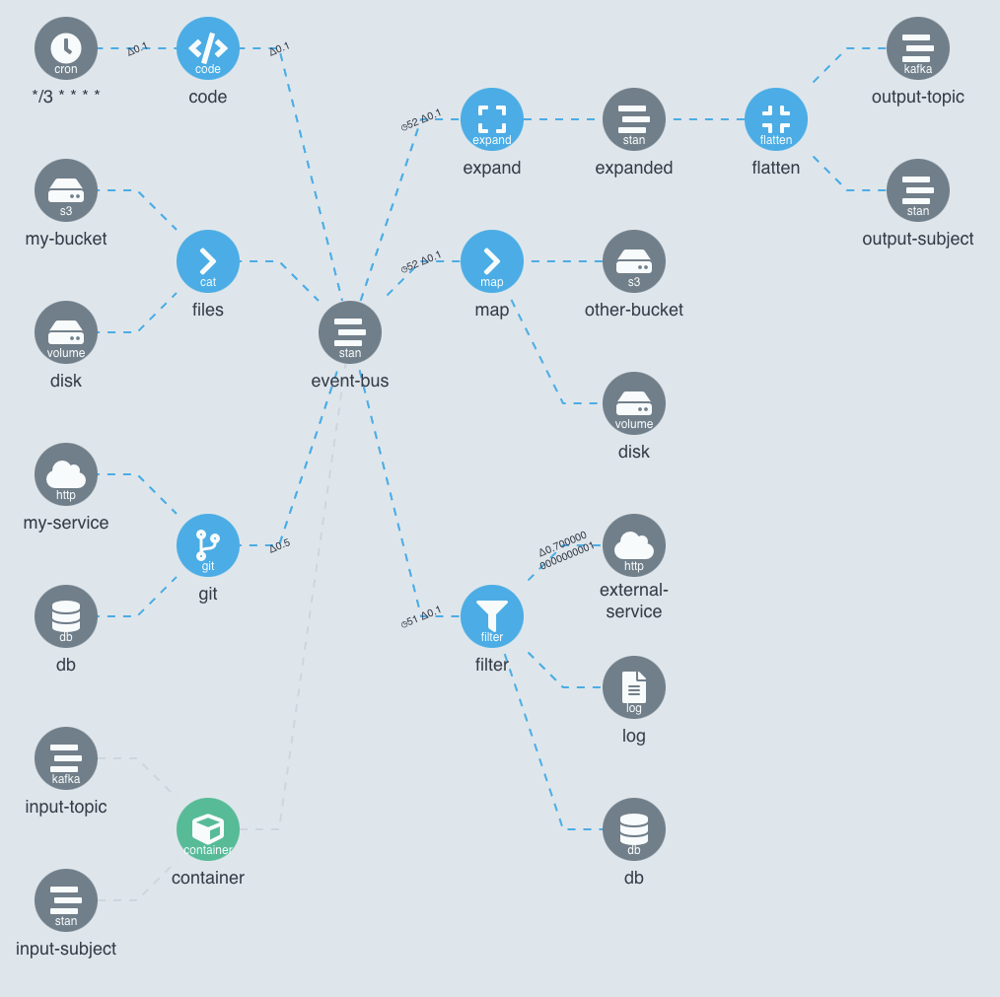
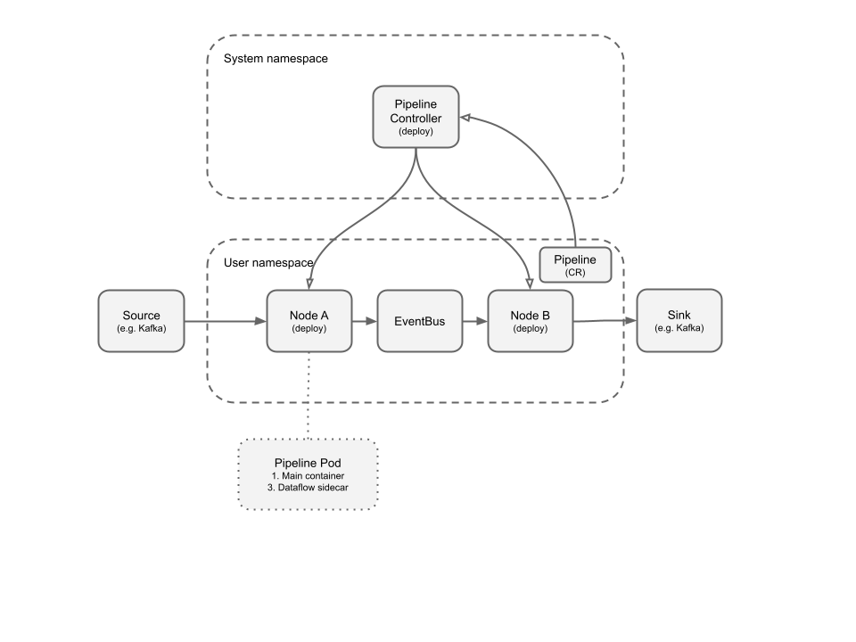

# Dataflow

[](https://github.com/argoproj-labs/argo-dataflow/actions/workflows/build.yml)
[](https://codecov.io/gh/argoproj-labs/argo-dataflow)

## Summary

Dataflow is a Kubernetes-native platform for executing large parallel data-processing pipelines.

Each pipeline is specified as a Kubernetes custom resource which consists of one or more steps which source and sink
messages from data sources such Kafka, NATS Streaming, or HTTP services.

Each step runs zero or more pods, and can scale horizontally using HPA or based on queue length using built-in scaling
rules. Steps can be scaled-to-zero, in which case they periodically briefly scale-to-one to measure queue length so they
can scale a back up.

Learn more about [features](docs/FEATURES.md).

[](https://youtu.be/afZT3aJ__jI)

## Use Cases

* Real-time "click" analytics
* Anomaly detection
* Fraud detection
* Operational (including IoT) analytics

## Screenshot



## Example

```bash
pip install git+https://github.com/argoproj-labs/argo-dataflow#subdirectory=dsls/python
```

```python
from argo_dataflow import cron, pipeline

if __name__ == '__main__':
    (pipeline('hello')
     .namespace('argo-dataflow-system')
     .step(
        (cron('*/3 * * * * *')
         .cat()
         .log())
    )
     .run())
```

## Documentation

Read in order:

Beginner:

* [Quick start](docs/QUICK_START.md)
* [Examples](docs/EXAMPLES.md)
* [Steps](docs/STEPS.md)
* [Sources](docs/SOURCES.md) and [Sinks](docs/SINKS.md)
* [Garbage collection](docs/GC.md)

Intermediate:

* [Handlers](docs/CODE.md)
* [Git usage](docs/GIT.md)
* [Reliability](docs/RELIABILITY.md)
* [Scaling](docs/SCALING.md)
* [Command line](docs/CLI.md)
* [Expression syntax](docs/EXPRESSIONS.md)
* [Meta-data](docs/META.md)
* [Workflow interop](docs/WORKFLOW_INTEROP.md)
* [Events interop](docs/EVENTS_INTEROP.md)
* [Kubectl](docs/KUBECTL.md)

Advanced

* [Configuration](docs/CONFIGURATION.md)
* [Features](docs/FEATURES.md)
* [Limitations](docs/LIMITATIONS.md)
* [Metrics](docs/METRICS.md)
* [Image contract](docs/IMAGE_CONTRACT.md)
* [Jaeger tracing](docs/JAEGER.md)
* [Reading material](docs/READING.md)
* [Security](docs/SECURITY.md)
* [Dataflow vs X](docs/DATAFLOW_VS_X.md)
* [Contributing](docs/CONTRIBUTING.md)

### Architecture Diagram

[](https://docs.google.com/drawings/d/1Dk7mgZ3jKpBg_DQ3c8og04ULoKpGTGUt52pBE-Vet2o/edit)
